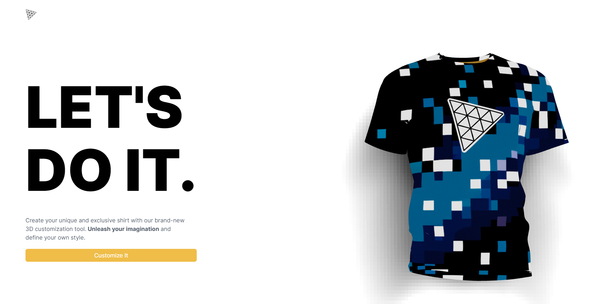
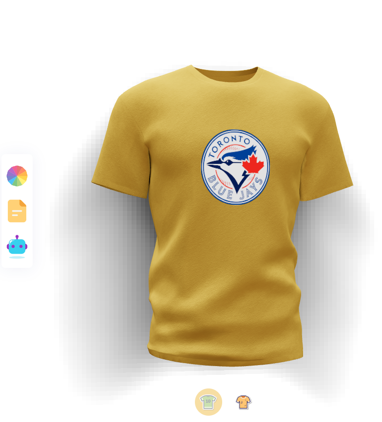
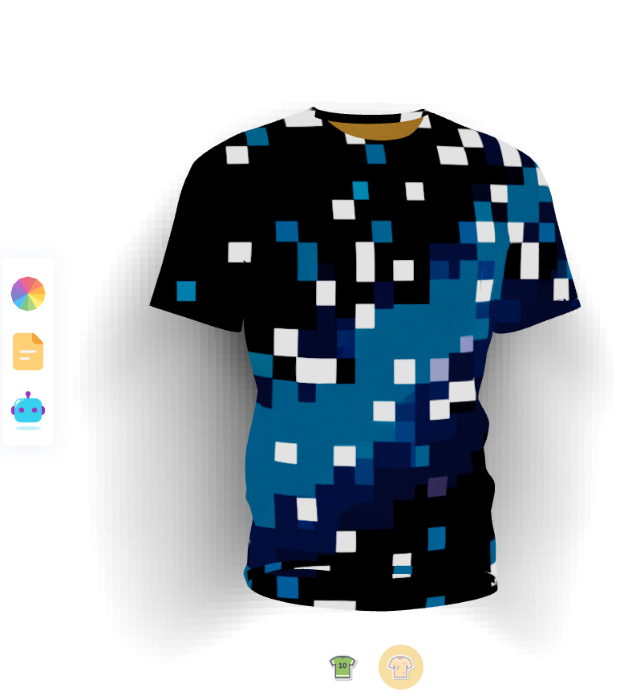
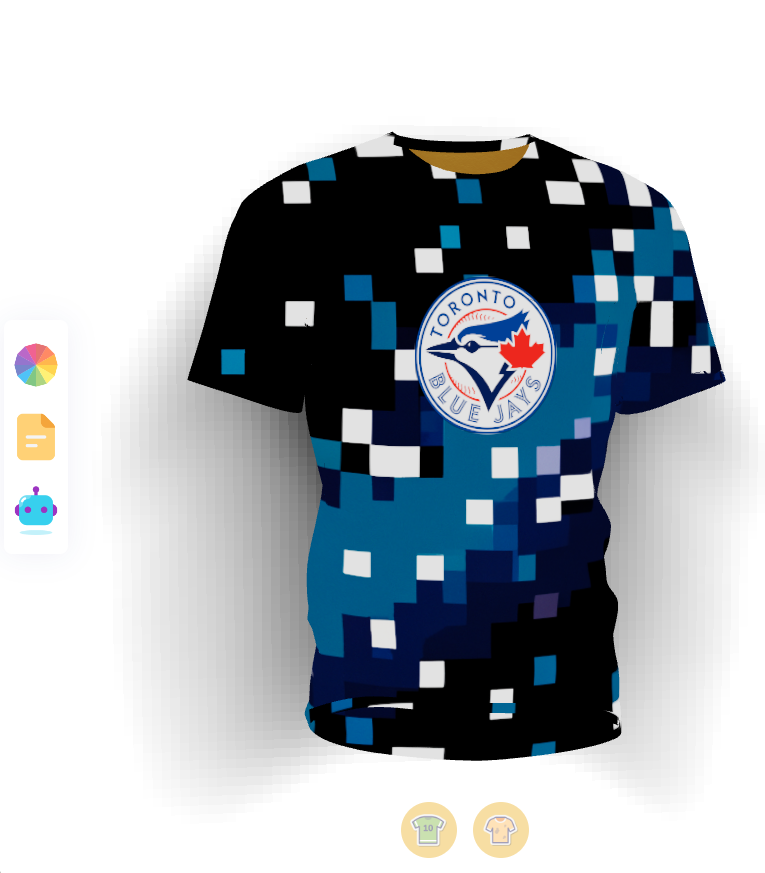

# FabrikThreeJS - Custom T-Shirt Design Website

## Introduction
FabrikThreeJS is a web application built using Three.js, Node.js, and OpenAI's powerful APIs. It allows users to create custom t-shirt designs effortlessly. Users can either upload their own logo and texture or ask AI to generate a unique logo and texture for them.

## Features
1. Custom Logo Creation: 
    - Utilize OpenAI's AI capabilities to create your unique logo or upload your existing logo.
    

2. Texture Customization: 
    - Experiment with various textures or use AI to generate a texture that suits your design.
    

3. Real-time Preview: 
    - See your design come to life with the real-time 3D preview feature powered by Three.js.
    

## Prerequisites
- Node.js: Make sure you have Node.js installed on your system. You can download it from nodejs.org.

## Installation
1. Clone the repository: git clone https://github.com/fabrikthreejs/fabrikthreejs.git

2. Navigate to the project directory: cd fabrikthreejs

3. Install dependencies: npm install

4. Start the application: npm start

5. Access the application in your browser: http://localhost:5173

## Usage
1. Create Your Custom Logo:
    - Click on the "Create Logo" button to generate a unique logo using OpenAI's API, or upload your own logo.

2. Customize Your T-Shirt Texture:
    - Click on the "Customize Texture" button to experiment with different textures, or ask AI to create one for you.
Preview and Save:

3. See the real-time 3D preview of your custom t-shirt design.
    - Once satisfied, click on the "Save Design" button to download your design as an image file.

## API Integration
FabrikThreeJS utilizes OpenAI's API to generate custom logos and textures. Make sure to set up your OpenAI API key for seamless integration. You can obtain an API key by signing up at openai.com.

To set up your OpenAI API key, create a .env file in the project directory and add the following line:

* OPENAI_API_KEY=your_api_key_here 

## Contribution
Contributions are welcome! Feel free to open issues or submit pull requests to help improve FabrikThreeJS.